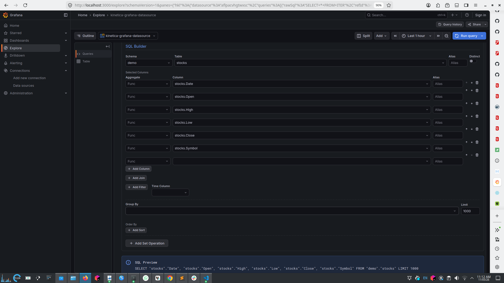
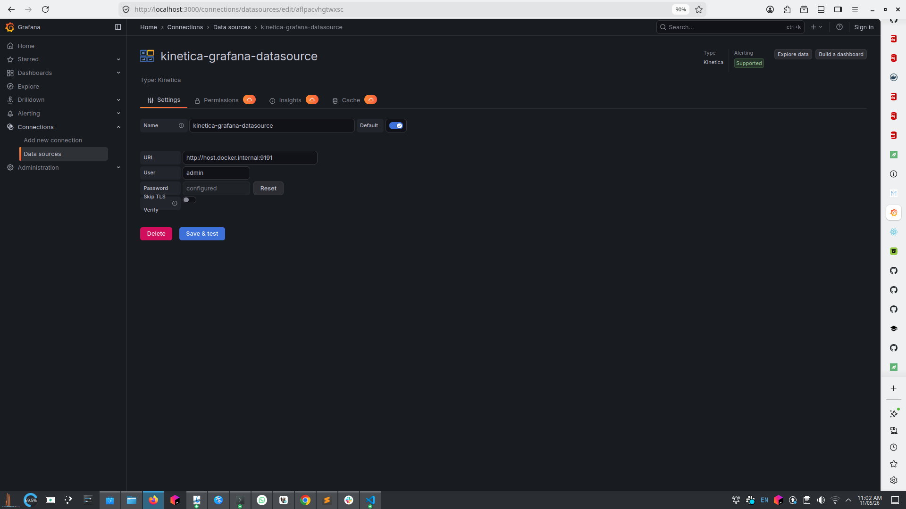
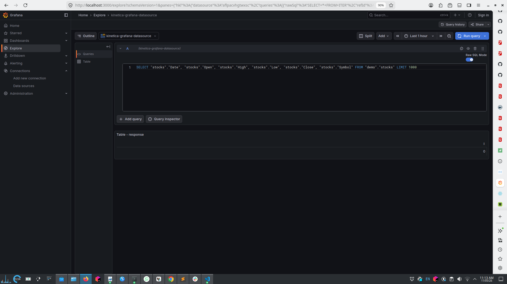

# Kinetica Datasource for Grafana

[](https://grafana.com)
[](https://grafana.com/grafana/plugins/kinetica-grafana-datasource)
[](https://grafana.com/grafana/plugins/kinetica-grafana-datasource)
[](LICENSE)

Connect Grafana to [Kinetica](https://www.kinetica.com) for real-time analytics and visualization of large-scale data. This plugin lets you query Kinetica using a visual query builder or raw SQL, and display the results in Grafana panels.



## Features

- **Visual Query Builder** — build SQL without writing it by hand
  - Schema, table, and column selection with autocomplete driven by live Kinetica metadata
  - Aggregation functions: `AVG`, `COUNT`, `MAX`, `MIN`, `SUM`, `VAR`, `STDDEV_POP`, `STDDEV_SAMP`, `VAR_POP`, `VAR_SAMP`
  - JOINs (`INNER`, `LEFT`, `RIGHT`, `FULL`) with multiple conditions
  - `WHERE` filters with AND/OR logic, and `HAVING` filters
  - `GROUP BY`, `ORDER BY` (ASC/DESC), `LIMIT`, and `DISTINCT`
  - Set operations: `UNION`, `UNION ALL`, `INTERSECT`, `INTERSECT ALL`, `EXCEPT`, `EXCEPT ALL`
- **Raw SQL Mode** — write queries directly in a Monaco editor with syntax highlighting
- **Time Series Support** — time columns are detected from Kinetica table metadata and converted automatically, so `datetime`/`timestamp`/`date` columns render as time series
- **Table Visualizations** — display query results in Grafana tables
- **Grafana Alerting** — create alerts from Kinetica query results
- **Secure Credentials** — passwords are stored in Grafana's encrypted secret storage and only ever decrypted in the backend
- **Concurrent Query Execution** — panels issuing multiple queries run them in parallel rather than sequentially

## Requirements

- Grafana >= 12.3.0
- Kinetica >= 7.x

**Note:** Grafana versions before 12.3.0 are not supported. The plugin is built against Grafana SDK 12.3.0 and `plugin.json` declares `grafanaDependency: ">=12.3.0"` to match; older versions are neither claimed nor tested. See [`docs/DEPENDENCY_MISMATCH_ANALYSIS.md`](docs/DEPENDENCY_MISMATCH_ANALYSIS.md) for the rationale.

## Installation

The plugin is published in the [Grafana plugin catalog](https://grafana.com/grafana/plugins/kinetica-grafana-datasource/) as `kinetica-grafana-datasource`.

### From the Grafana catalog (recommended)

Using the Grafana CLI:

```bash
grafana cli plugins install kinetica-grafana-datasource
```

Or from the UI: **Administration > Plugins**, search for "Kinetica", and click **Install**. Restart Grafana afterwards.

### Manual installation

1. Download the latest release from the [releases page](https://github.com/kineticadb/grafana-kinetica-datasource/releases).
2. Extract it into your Grafana plugins directory (usually `/var/lib/grafana/plugins`).
3. Restart Grafana.

Release archives are **signed** (a commercial signature issued to the `kinetica` organization), so no unsigned-plugin allowance is needed. Locally built development builds *are* unsigned — see [Running locally](#running-locally).

The plugin ships a backend binary (`gpx_kinetica_datasource`) that Grafana launches as a child process, so the plugin directory must be on a filesystem that permits execution.

## Configuration

1. Go to **Connections > Data sources**.
2. Click **Add new data source** and select **Kinetica**.
3. Configure the connection:
   - **URL** — your Kinetica server URL (e.g. `http://localhost:9191`)
   - **User** — database username
   - **Password** — database password (stored encrypted)
   - **Skip TLS Verify** — skips TLS certificate verification. Insecure; use only for testing.
4. Click **Save & test** to verify the connection.



## Usage

### Visual Query Builder

1. Create a panel and select the Kinetica datasource.
2. Build the query: pick a schema and table, add columns with optional aggregations, add JOINs, `WHERE` filters, `GROUP BY`, and `ORDER BY`.
3. Click **Run Query**.

Column order in the panel matches your SELECT order. If Kinetica is unreachable, the editor shows a dismissible **Connection Error** alert rather than silently rendering empty dropdowns.

### Raw SQL Mode

1. Toggle **Raw SQL Mode** in the query editor.
2. Write your query in the code editor.
3. The query runs on blur, or when you run the panel.



### Time Series Queries

1. Select a time column in the **Time Column** dropdown.
2. Use `$__timeFilter()` in your query so Grafana's time range picker filters the data.

Time handling is metadata-driven: the backend inspects the table schema to learn which columns are `datetime`, `timestamp`, or `date`. Aggregates are handled carefully — only time-preserving aggregates (`MIN`, `MAX`, `FIRST`, `LAST`, or none) keep a column typed as time, while `COUNT`/`SUM`/`AVG` of a date column produce a number.

### Macros

These macros are expanded by the plugin backend before the query reaches Kinetica:

| Macro | Description |
|-------|-------------|
| `$__timeFilter(column)` | Time range filter from Grafana's time picker. Type-aware: emits quoted timestamp literals for string/date columns, epoch milliseconds otherwise. |
| `$__timeFrom()` | Start of the selected time range |
| `$__timeTo()` | End of the selected time range |
| `$__unixEpochFrom()` | Start of the selected time range, as a Unix epoch value |
| `$__unixEpochTo()` | End of the selected time range, as a Unix epoch value |

## Known limitations

- **No `$__timeGroup` macro.** Time bucketing must be written explicitly in SQL. Earlier versions of this README documented `$__timeGroup`, `$__from`, and `$__to`; none of them are implemented.
- **Dashboard and template variables are not interpolated.** The datasource does not override `applyTemplateVariables`, so a reference such as `$myVar` is passed to Kinetica verbatim and will fail. Use the macros above for time ranges.
- **`OFFSET` has no query-builder control.** It exists in the query model and SQL generator, so it can be set in a provisioned or hand-edited query JSON, but there is no field for it in the editor UI.
- **Metadata calls are uncached.** Every schema, table, and column dropdown triggers a live database call.
- **The E2E suite covers 7 stable scenarios** (alerts, provisioning, basic page loads), narrowed from an initial 34 so it passes reliably across supported Grafana versions. See [`E2E_TESTS_README.md`](E2E_TESTS_README.md).
- Query errors surfaced in the Grafana UI are intentionally generic; the detail is written to the Grafana server log. Enable backend debug logging with `GF_LOG_FILTERS=plugin.kinetica-grafana-datasource:debug`.

## Documentation

For Kinetica itself, see the [Kinetica Documentation](https://docs.kinetica.com). Plugin-specific engineering notes — packaging, release, dependency analysis, and CI troubleshooting — live in [`docs/`](docs/).

Release history is in [CHANGELOG.md](CHANGELOG.md).

## Development

### Prerequisites

- Node.js >= 22
- Go 1.26.x (matching the `go` directive in `go.mod`; CI pins `1.26`)
- [Mage](https://magefile.org) (Go build tool)
- Docker (for the local Grafana environment and E2E tests)

### Building

```bash
# Install frontend dependencies
npm install

# Build frontend
npm run build

# Build backend for the current platform
mage build

# Build backend for all platforms
mage buildAll
```

### Running locally

```bash
# Frontend, with rebuild on save
npm run dev

# In another terminal, start Grafana with the plugin mounted
docker compose up -d
```

Grafana is at http://localhost:3000 (default credentials: `admin`/`admin`). The backend connects to Kinetica at `host.docker.internal:9191` by default; copy `.env.example` to `.env` to set credentials.

Local builds are unsigned, so `docker-compose.yaml` sets `GF_PLUGINS_ALLOW_LOADING_UNSIGNED_PLUGINS=kinetica-grafana-datasource`. If you load a local build into a Grafana instance of your own, you'll need the equivalent setting:

```ini
# grafana.ini
[plugins]
allow_loading_unsigned_plugins = kinetica-grafana-datasource
```

Frontend changes are picked up by `npm run dev` on save. **Backend changes require `mage build` plus a Grafana restart.**

### Testing

```bash
# Frontend unit tests
npm run test:ci

# Backend tests with coverage
mage coverage

# Backend tests directly, with the race detector
go test -race ./pkg/...

# E2E tests (requires Grafana running — see E2E_TESTS_README.md)
npm run e2e
```

### Linting

```bash
npm run lint       # eslint
npm run lint:fix   # eslint --fix + prettier
npm run typecheck  # tsc --noEmit
```

CI runs typecheck → lint → `test:ci` → frontend build → backend tests → `mage buildAll`. Run these locally before pushing.

## Architecture

The plugin has two halves that ship together:

- **Frontend** (`src/`, TypeScript + React) — config and query-editor UI, running inside Grafana's browser app. SQL is generated here from the builder model (`src/sqlGenerator.ts`).
- **Backend** (`pkg/`, Go) — a standalone binary that Grafana launches as a child process and talks to over gRPC. **Only the backend talks to Kinetica**; the frontend reaches the database exclusively through backend resource calls.

The frontend sends both the finished `rawSql` and the structured builder model. The backend expands macros, executes the SQL via the Kinetica Go API, decodes the Avro response, and builds a Grafana data frame.

## Contributing

Contributions are welcome.

1. Fork the repository
2. Create a feature branch
3. Make your changes
4. Run the tests and linting above
5. Submit a pull request

## License

Licensed under the MIT License — see [LICENSE](LICENSE).

## Support

- [Issue Tracker](https://github.com/kineticadb/grafana-kinetica-datasource/issues)
- [Kinetica Community](https://community.kinetica.com)
